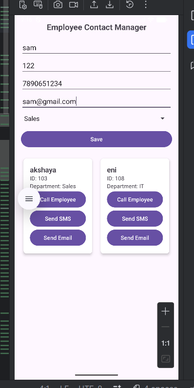

# 📱 Employee Contact Manager App

## 📖 About the Project
Employee Contact Manager App is a simple and user-friendly Android application developed using Android Studio. The app is designed to manage employee contact details efficiently within an organization.

This project demonstrates the practical implementation of core Android development concepts and real-world contact management functionality.

---

## 🚀 Features
- Add employee details (Name, ID, Phone Number, Department)
- Department selection using Spinner
- Display employee records using ListView / GridView with CardView
- Navigation between screens using Intents
- Call employee using implicit Intent
- Send SMS using implicit Intent
- Send Email using implicit Intent
- Confirmation DialogBox before performing telephony actions
- Clean and modern user interface

---

## 🛠 Technologies Used
- Java
- XML Layout Design
- Android Studio
- Activities
- Intents (Explicit & Implicit)
- Spinner
- CardView
- ListView / GridView
- AlertDialog (DialogBox)

---

## 📂 Project Structure
- Java Source Files: `app/src/main/java`
- XML Layout Files: `app/src/main/res/layout`
- AndroidManifest.xml: `app/src/main`

---

## 🎯 Learning Outcome
This project showcases:
- UI design in Android
- Activity lifecycle management
- Intent-based navigation
- Implementation of communication features (Call, SMS, Email)
- Use of DialogBox for user confirmation

---

## 📸 App Screenshot

## 👩‍💻 Developed By
Register Number: 732923ITR028
